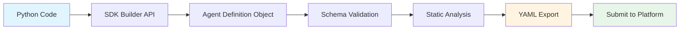

import { Callout } from 'nextra/components'

# Compiler, Not Runtime

The Ainalyn SDK is **compiler-first** and ships an optional runtime wrapper for ATOMIC handlers. That wrapper does not own execution authority?**Platform Core** does. This distinction keeps responsibilities clear and prevents costly misconceptions.

## The Core Distinction

<Callout type="info">
**SDK = Compiler (plus optional runtime wrapper)**
Transforms your Python code into a validated YAML definition and offers a thin adapter for ATOMIC handlers.

**Platform Core = Runtime**
Executes the definition, manages resources, handles billing, and enforces governance.
</Callout>

Think of it like this:

- A **compiler** (like `gcc` or `javac`) transforms source code into executable format. It checks syntax, validates types, and catches errors—but it doesn't run your program.
- A **runtime** (like the JVM or operating system) actually executes the compiled output, manages memory, handles I/O, and enforces security policies.

The Ainalyn SDK is your compiler-first toolkit. Platform Core is the runtime authority.

## What the SDK Actually Does

The SDK's job is to help you build a **valid Agent Definition** and catch errors early:

```python
from ainalyn import AgentBuilder, validate, export_yaml

# Build: Describe what your agent does
agent = (
    AgentBuilder("email-parser")
    .version("1.0.0")
    .description("Extract emails from text")
    .add_workflow(workflow)
    .build()
)

# Validate: Check schema, review gates, and static analysis
result = validate(agent)
if result.is_valid:
    # Compile: Transform to YAML
    yaml_output = export_yaml(agent)
```

At this point, you have a **description**. Not an execution. Not a running agent. Just a validated definition ready for submission to Platform Core.

## What the SDK Does NOT Do

<Callout type="warning">
The SDK does **not** and **cannot**:

- Execute your agent workflows
- Call external APIs or tools
- Manage authentication or API keys
- Calculate execution costs
- Handle retries or error recovery
- Make decisions about billing
- Enforce governance policies
- Create Executions
</Callout>

These are **Platform Core responsibilities**. Only Platform Core has the authority to execute, bill, and govern.

## Why This Matters

### 1. Local Validation ≠ Platform Approval

Just because your agent compiles successfully doesn't mean Platform Core will accept it:

```python
# SDK says: "Valid structure"
result = validate(agent)
assert result.is_valid  # ✓ Passes

# But Platform Core might still reject it for:
# - Security policy violations
# - Excessive resource usage
# - Restricted content
# - Governance rules
# - Business policy constraints
```

The SDK checks **schema, review gates, and static analysis**. Platform Core enforces **platform policies**.

### 2. SDK Cannot Predict Execution Costs

```python
# This does NOT calculate costs
agent = AgentBuilder("my-agent").build()
# ❌ No cost estimation available

# Costs are determined by:
# - Actual execution (runtime usage)
# - Resources consumed (tokens, API calls)
# - Platform pricing policy
# - Dynamic factors (model costs, etc.)
```

**Only Platform Core knows execution costs** because only Platform Core executes agents.

### 3. SDK Cannot Run Workflows

```python
# This creates a DESCRIPTION of a workflow
workflow = (
    WorkflowBuilder("process")
    .add_node(NodeBuilder("node1").next_nodes("node2").build())
    .add_node(NodeBuilder("node2").build())
    .build()
)

# ❌ SDK cannot run this workflow
# ❌ SDK cannot call the tools/prompts
# ❌ SDK cannot produce execution results

# ??SDK can validate schema, review gates, and static analysis:
# - Required fields and formats
# - Review gate compliance
# - Cycles, unreachable nodes, and references
```

## The Compilation Process

What happens when you use the SDK:



Steps 1-6: **SDK (Compiler)**
Step 7: **Platform Core (Runtime)**

### Compilation Steps

1. **Build**: Use fluent API to construct definition
   ```python
   agent = AgentBuilder("my-agent").version("1.0.0").build()
   ```

2. **Validate**: Check schema, review gates, and static analysis
   ```python
   result = validate(agent)
   ```

3. **Export**: Transform to YAML
   ```python
   yaml_content = export_yaml(agent)
   ```

4. **Submit**: Send to Platform Core for review
   ```python
   submission = submit_agent(agent, api_key="dev_sk_xxx")
   ```

### Platform Core Steps (Outside SDK)

5. **Review**: Platform applies governance policies
6. **Approve/Reject**: Platform decides if agent can be listed
7. **Marketplace**: Agent becomes available to users
8. **Execution**: Users invoke agent → Platform creates Execution
9. **Billing**: Platform calculates costs based on actual usage

## Execution Authority

Per the Platform Constitution, **execution authority belongs exclusively to Platform Core**.

| Entity | Can Describe | Can Execute | Can Bill |
|--------|-------------|-------------|----------|
| SDK | ✓ | ✗ | ✗ |
| Platform Core | ✓ | ✓ | ✓ |
| Client Apps | ✗ | ✗ | ✗ |
| Developer | ✓ (via SDK) | ✗ | ✗ |

<Callout type="error">
**Hard Constraint**: No system except Platform Core can create Executions, determine execution success/failure, or calculate billing.

This is not a technical limitation—it's a **governance boundary** that ensures consistency, security, and fair billing across the platform.
</Callout>

## Common Misconceptions

### ❌ "The SDK runs my agent locally"

No. The SDK builds a definition. Platform Core runs agents.

```python
# This doesn't run anything
agent = AgentBuilder("test").build()
validate(agent)  # Just checks structure
```

### ❌ "If validation passes, my agent will work"

Not guaranteed. The SDK validates schema, review gates, and static analysis. Platform Core validates policy.

```python
# Passes SDK validation
result = validate(agent)
assert result.is_valid

# But Platform Core might reject for:
# - Security violations
# - Resource limits
# - Governance policies
```

### ❌ "I can test execution locally"

No. There is no local runtime. You must submit to Platform Core.

```python
# ❌ No local testing available
# ❌ No simulation mode
# ✓ Submit to Platform Core for real execution
```

### ❌ "The SDK handles billing"

Never. Billing is **always** Platform Core's responsibility.

```python
# SDK cannot and will not:
# - Calculate costs
# - Apply pricing policies
# - Generate invoices
# - Process payments
```

## What You Control

As a developer using the SDK, you control:

✓ **Agent Definition structure**
- Workflows, nodes, prompts, tools
- Input/output specifications
- Resource declarations

✓ **Local validation**
- Catch schema issues and review gate violations early
- Verify reference integrity
- Check DAG validity

✓ **YAML output**
- Format for submission
- Version control
- Documentation

✗ **Execution** - Platform Core only
✗ **Billing** - Platform Core only
✗ **Governance** - Platform Core only
✗ **Resource allocation** - Platform Core only
✗ **User authentication** - Platform Core only

## The Boundary

```
┌─────────────────────────────────────────────────────────┐
│  YOUR RESPONSIBILITY (SDK as Compiler)                  │
│                                                          │
│  • Write agent definitions                              │
│  • Validate structure                                   │
│  • Export to YAML                                       │
│  • Submit to Platform Core                              │
│                                                          │
└─────────────────────────────────────────────────────────┘
                            ↓
                     [Submit Definition]
                            ↓
┌─────────────────────────────────────────────────────────┐
│  PLATFORM CORE RESPONSIBILITY (Runtime)                 │
│                                                          │
│  • Review and approve definitions                       │
│  • Execute workflows                                    │
│  • Manage resources (LLMs, tools, APIs)                 │
│  • Handle authentication                                │
│  • Enforce governance policies                          │
│  • Calculate costs and billing                          │
│  • Create and manage Executions                         │
│  • Deliver results to users                             │
│                                                          │
└─────────────────────────────────────────────────────────┘
```

## Summary

The Ainalyn SDK is a **description compiler**, not an execution runtime:

- **Compilers validate and transform** — The SDK checks structure and exports YAML
- **Runtimes execute and manage** — Platform Core runs workflows and handles everything else
- **Boundaries are constitutional** — These aren't technical limitations; they're governance rules that ensure platform integrity

When you use the SDK, you're writing a **recipe** (Agent Definition).
Platform Core is the **kitchen** that actually cooks it (Execution).

## Next Steps

- [Agent Definition](/v1/concepts/agent-definition/) - Understand the definition structure
- [What You Control](/v1/concepts/what-you-control/) - SDK vs Platform responsibilities in detail
- [Validation](/v1/guides/validation/) - What the SDK validates and why
